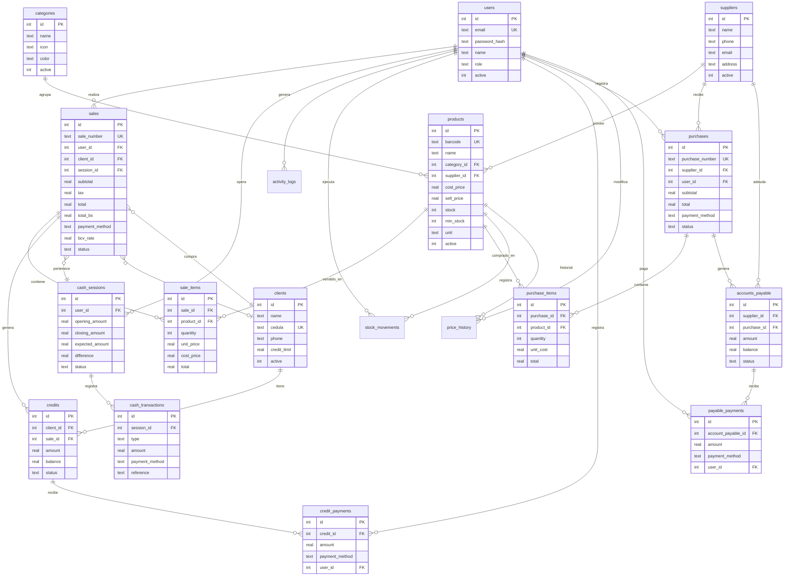

# 🗄️ Modelo de Datos — Elbrother POS

## Diagrama Entidad-Relación

## Tablas Principales

### `users` — Usuarios del sistema
| Campo | Tipo | Descripción |
|-------|------|-------------|
| id | INTEGER PK | Auto-incremental |
| email | TEXT UNIQUE | Email de acceso |
| password_hash | TEXT | Hash bcrypt |
| name | TEXT | Nombre para mostrar |
| role | TEXT | `admin` o `cashier` |
| active | INTEGER | 1=activo, 0=inactivo |

### `products` — Catálogo de productos
| Campo | Tipo | Descripción |
|-------|------|-------------|
| id | INTEGER PK | Auto-incremental |
| barcode | TEXT UNIQUE | Código de barras (opcional) |
| name | TEXT | Nombre del producto |
| category_id | INTEGER FK | Categoría |
| supplier_id | INTEGER FK | Proveedor |
| cost_price | REAL | Precio de costo (USD) |
| sell_price | REAL | Precio de venta (USD) |
| stock | INTEGER | Unidades disponibles |
| min_stock | INTEGER | Alerta de stock bajo (default: 5) |
| unit | TEXT | Unidad de medida (default: `und`) |

### `sales` — Transacciones de venta
| Campo | Tipo | Descripción |
|-------|------|-------------|
| sale_number | TEXT UNIQUE | Formato: `TRX-YYYYMMDD-NNNN` |
| total | REAL | Total en USD |
| total_bs | REAL | Total en Bolívares |
| payment_method | TEXT | `cash`, `card`, `transfer`, `credit` |
| bcv_rate | REAL | Tasa BCV al momento de la venta |
| status | TEXT | `completed`, `voided`, `credit` |

### `cash_sessions` — Sesiones de caja
| Campo | Tipo | Descripción |
|-------|------|-------------|
| opening_amount | REAL | Monto de apertura |
| closing_amount | REAL | Monto al cierre |
| expected_amount | REAL | Monto esperado (calculado) |
| difference | REAL | Diferencia (cierre - esperado) |
| status | TEXT | `open` o `closed` |

### `purchases` — Compras a proveedores
| Campo | Tipo | Descripción |
|-------|------|-------------|
| purchase_number | TEXT UNIQUE | Formato: `COMP-YYYYMMDD-NNNN` |
| supplier_id | INTEGER FK | Proveedor |
| payment_method | TEXT | `cash`, `transfer`, `credit` |

### `credits` — Créditos de clientes
| Campo | Tipo | Descripción |
|-------|------|-------------|
| amount | REAL | Monto original |
| balance | REAL | Saldo pendiente |
| status | TEXT | `active` o `paid` |

### `accounts_payable` — Cuentas por pagar a proveedores
| Campo | Tipo | Descripción |
|-------|------|-------------|
| amount | REAL | Monto original |
| balance | REAL | Saldo pendiente |
| status | TEXT | `active` o `paid` |

## Índices

| Índice | Tabla | Columna(s) | Propósito |
|--------|-------|------------|-----------|
| idx_products_barcode | products | barcode | Búsqueda rápida por código |
| idx_products_category | products | category_id | Filtro por categoría |
| idx_products_name | products | name | Búsqueda por nombre |
| idx_sales_date | sales | created_at | Reportes por fecha |
| idx_sales_user | sales | user_id | Ventas por usuario |
| idx_sale_items_sale | sale_items | sale_id | Items de una venta |
| idx_sale_items_product | sale_items | product_id | Ventas de un producto |
| idx_stock_movements_product | stock_movements | product_id | Historial de stock |
| idx_credits_client | credits | client_id | Créditos por cliente |
| idx_purchases_date | purchases | created_at | Compras por fecha |
| idx_accounts_payable_supplier | accounts_payable | supplier_id | Deudas por proveedor |
